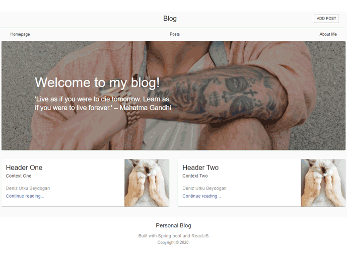

# Blog w/ ReactJS and Spring Boot
# ReactJS ve Spring Boot ile Blog Uygulaması Örneği





# English(EN)

Tutorial in Turkish : (Link)

### Running Spring Boot application
Running from an IDE

> You can run a Spring Boot application from your IDE as a simple Java application, however, first you will need to import > > your project. Import steps will vary depending on your IDE and build system. Most IDEs can import Maven projects directly, > for example Eclipse users can select Import…​ → Existing Maven Projects from the File menu.
> If you can’t directly import your project into your IDE, you may be able to generate IDE metadata using a build plugin. > > Maven includes plugins for Eclipse and IDEA; Gradle offers plugins for various IDEs.


Using maven plugin

> The Spring Boot Maven plugin includes a run goal which can be used to quickly compile and run your application. Applications run in an exploded form just like in your IDE.

```sh
$ mvn spring-boot:run
```


### Running ReactJS application

```sh
$ cd personalblog-master
$ npm install
$ npm install react-router-dom @material-ui/core @material-ui/icons
$ npm start
```


# Turkish(TR)

Uygulamanın yapılışı ile ilgili blog yazısı: (Link)

### Spring Boot uygulamasını başlatma
IDE ile başlatma

> You can run a Spring Boot application from your IDE as a simple Java application, however, first you will need to import > > your project. Import steps will vary depending on your IDE and build system. Most IDEs can import Maven projects directly, > for example Eclipse users can select Import…​ → Existing Maven Projects from the File menu.
> If you can’t directly import your project into your IDE, you may be able to generate IDE metadata using a build plugin. > > Maven includes plugins for Eclipse and IDEA; Gradle offers plugins for various IDEs.

> Spring Boot uygulamasını favori IDE'niz ile başlatabilirsiniz.

Maven kullanarak başlatma

```sh
$ mvn spring-boot:run
```


### ReactJS uygulamasını başlatma

```sh
$ cd personalblog-master
$ npm install
$ npm install react-router-dom @material-ui/core @material-ui/icons
$ npm start
```


